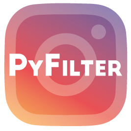

<!-- MARKDOWN LINKS & IMAGES -->
<!-- https://www.markdownguide.org/basic-syntax/#reference-style-links
[contributors-shield]: https://img.shields.io/github/contributors/jjeanjacques10/pyfilter.svg?style=for-the-badge
[contributors-url]: https://github.com/jjeanjacques10/pyfilter/graphs/contributors

[forks-shield]: https://img.shields.io/github/forks/jjeanjacques10/pyfilter.svg?style=for-the-badge
[forks-url]: https://github.com/jjeanjacques10/pyfilter/network/members

[stars-shield]: https://img.shields.io/github/stars/jjeanjacques10/pyfilter.svg?style=for-the-badge
[stars-url]: https://github.com/jjeanjacques10/pyfilter/stargazers

[issues-shield]: https://img.shields.io/github/issues/jjeanjacques10/pyfilter.svg?style=for-the-badge
[issues-url]: https://github.com/jjeanjacques10/pyfilter/issues

[license-shield]: https://img.shields.io/github/license/jjeanjacques10/pyfilter.svg?style=for-the-badge
[license-url]: https://github.com/jjeanjacques10/pyfilter/blob/master/LICENSE

[linkedin-shield]: https://img.shields.io/badge/-LinkedIn-black.svg?style=for-the-badge&logo=linkedin&colorB=555

 -->
<!-- PROJECT LOGO -->
<br />
<p align="center">
  <a href="https://github.com/jjeanjacques10/pyfilter">
    
  </a>

  <h3 align="center">Pyfilter - Instagram Filter</h3>

  <p align="center">
    Simple Instagram-like image filters using OpenCV
    <br />
    <br />
    <a href="https://github.com/jjeanjacques10/pyfilter/issues">Report Bug</a>
    ·
    <a href="https://github.com/jjeanjacques10/pyfilter/issues">Request Feature</a>
  </p>
</p>


<!-- ABOUT THE PROJECT -->
## About The Project

Development of an executable application of image filters in real time using OpenCV with Python

The main features of this application are:
- No Filter
- Blur Faces
- Blur Eyes
- Contour Filter
- Gray Scale Filter
 
### Built With

The main technologies used for the development of this project are:

- [Python 3](https://www.python.org/)
- [OpenCV](https://opencv.org/)
- [Matplotlib](https://matplotlib.org/)
- [Numpy](https://numpy.org/)

<!-- GETTING STARTED -->
## Getting Started

To clone and run this project locally, follow these simple example steps:

### Installation

1. Clone the repo
   ```sh
   git clone https://github.com/jjeanjacques10/pyfilter.git
   ```
3. Run the main.py file at the root of the project directory
   ```sh
   python main.py
   ```

<!-- CONTRIBUTING -->
## Contributing
Contributions are what make the open source community such an amazing place to be learn, inspire, and create. Any contributions you make are **greatly appreciated**.
1. Fork the Project _(Fork button on Github)_
```sh
start https://github.com/jjeanjacques10/pyfilter
```
2. Create your Feature Branch 
```sh
git checkout -b feature/AmazingFeature
```
3. Commit your Changes 
```sh
git commit -m 'Add some AmazingFeature'
```
4. Push to the Branch 
```sh
git push origin feature/AmazingFeature
```
5. Open a Pull Request _(Pull Request page on Github)_

```sh
start https://github.com/jjeanjacques10/pyfilter/pulls
```

<!-- LICENSE -->
## License

Distributed under the MIT License. See `LICENSE` for more information.

---
Developed by [Jean Jacques](https://github.com/jjeanjacques10/) and [Gabriel Petillo](https://github.com/gspetillo/)
